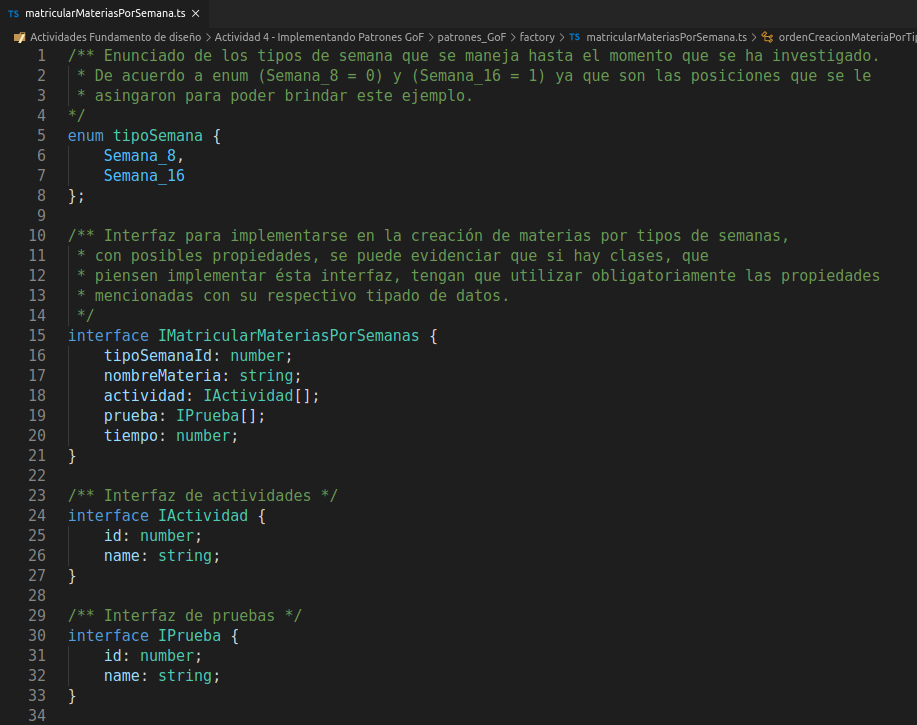
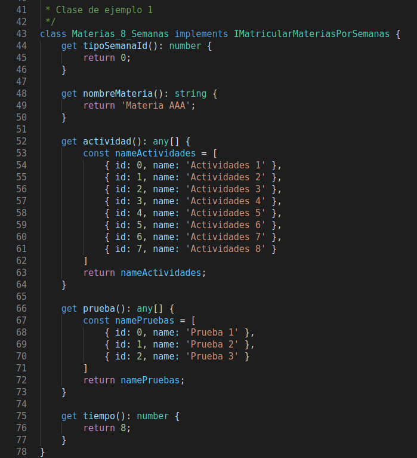
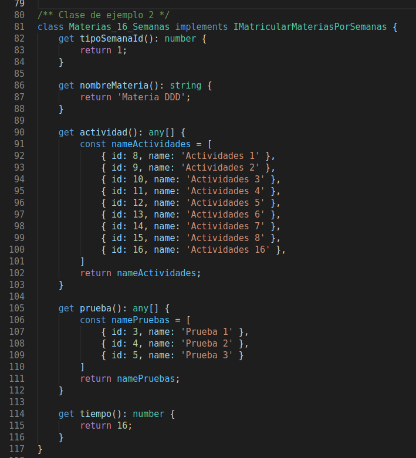
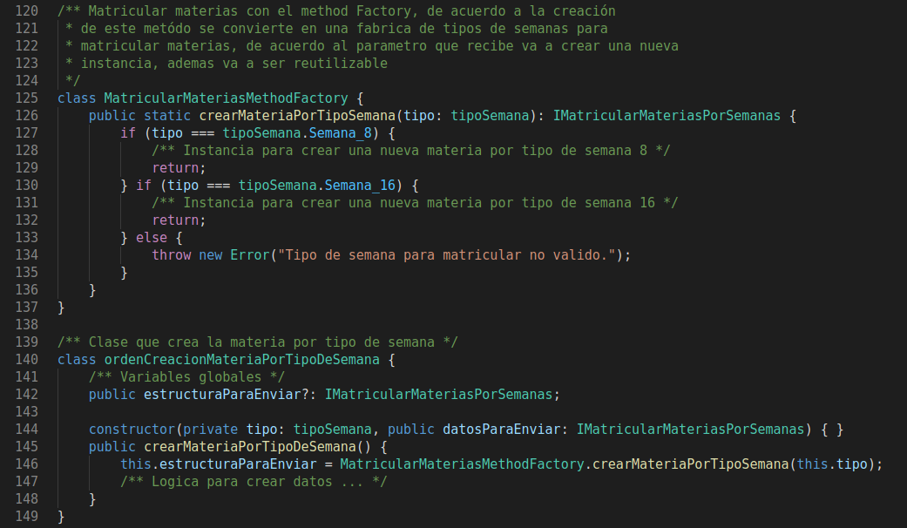
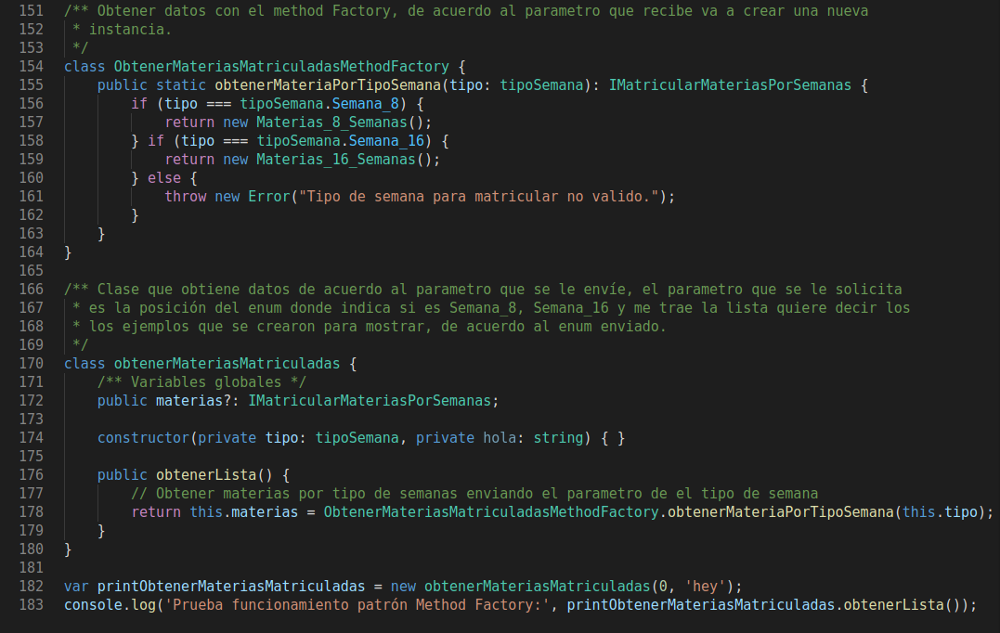
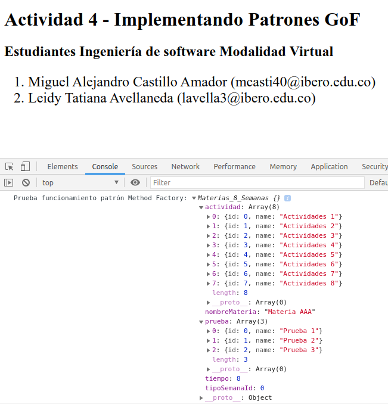

# Actividad 4 - Implementando Patrones GoF

Este proyecto fue generado con [Typescript](https://www.typescriptlang.org/) versión 3.8.3.

## Servidor de desarrollo

Vaya a `../patrones_GoF/factory` por medio de consola y ejecute `tsc *ts --watch` para un servidor de desarrollo (por si se requieren hacer cambios en los archivos `.ts` y se deseen ver reflejados). La aplicación se recargará automáticamente si cambia alguno de los archivos de origen.

## Implementación de patrón GoF en Typescript describiendo el proceso académico de la universidad (Matricula de materias por semanas)

Los patrones nos permiten a los desarrolladores a estar mas seguros de la validez del código, ya
que son soluciones que funcionan, y han sido estudiadas y probadas por muchos desarrolladores,
esta práctica se usa para identificar condiciones de error y problemas en el código que pueden no
ser evidentes en ese momento. No sobra resaltar que los patrones no son acciones obligatorias.
Los patrones de diseño se clasifican en tres categorías: Patrones creacionales, Patrones
estructurales y Patrones de comportamiento.

**Patrones creacionales:** Proporcionan diversos mecanismos de creación de objetos, que
aumentan la flexibilidad y la reutilización del código existente de una manera adecuada.

**Patrones estructurales:** El concepto de herencia se utiliza para componer interfaces y definir
formas de componer objetos para obtener nuevas funcionalidades.

**Patrones de comportamiento:** Estos patrones de diseño están específicamente relacionados con
la comunicación entre objetos.

Para este ejemplo se creará un ejercicio de un proceso académico de la univerdad (Matricula de materias por semanas).

1. Se crea un enum para implementar brindar un ejemplo y algunas interfaces

***Fuente:** original*
___

2. Se crean clases de ejemplo para mostrar la funcionalidad del patrón Method Factory

***Fuente:** original*

***Fuente:** original*
___

3. Se crea una clase donde se evidencia el method factory para la creación de las materias por tipo de semana, y se crea un método donde se debe implentar la logica para almacenar los datos.

***Fuente:** original*
___

4. Se crean clase donde se evidencia el method factory para la obtener datos de las materias por tipo de semana, y se crea un método donde obtiene los datos por poder ser impresos en la consola del buscardor o browser.

***Fuente:** original*
___

5. Ejemplo que se evidencia en el momento de abrir el archivo `index.html`

***Fuente:** original*
